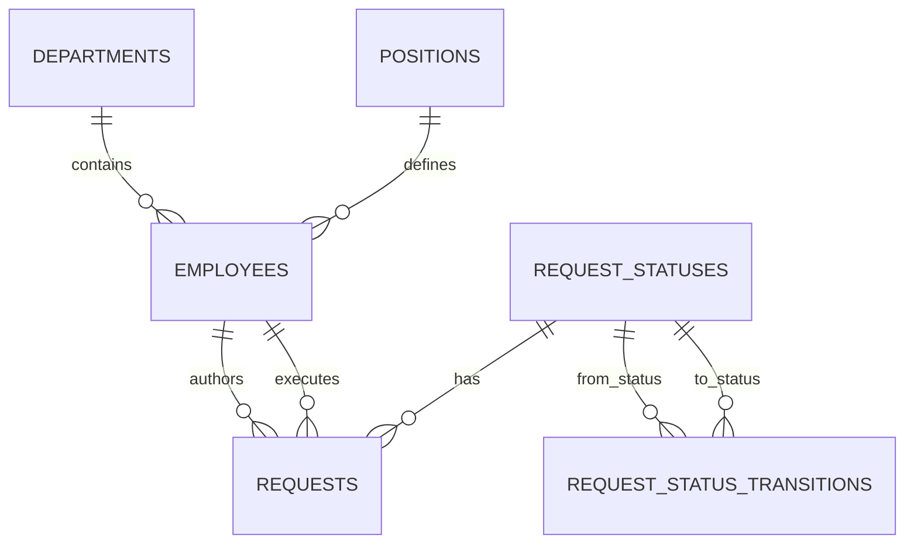

# Employee Requests

Веб-приложение для учёта заявок сотрудников.

## Реализовано

- HTTP-сервер и endpoint `GET /health`;
- проверка доступности PostgreSQL через health-check;
- конфигурация приложения и пула соединений через переменные окружения;
- подключение к PostgreSQL через `pgxpool`;
- корректное завершение HTTP-сервера и пула соединений;
- объектная модель сотрудников и заявок;
- бизнес-правила переходов статусов;
- нормализованная схема PostgreSQL;
- PostgreSQL-репозитории сотрудников и заявок;
- REST API подразделений, должностей, сотрудников и заявок с валидацией и единым форматом ошибок;
- агрегатный отчёт по статусам, просроченным заявкам и исполнителям;
- последовательное применение SQL-миграций;
- генератор 1000 сотрудников и 1 000 000 заявок;
- воспроизводимый замер производительности до и после оптимизации;
- Dockerfile и Docker Compose.

## Бизнес-процесс

Допустимы только последовательные переходы:

```text
Новая -> В работе -> Выполнена
```

Переход из статуса `Новая` сразу в `Выполнена`, возврат на предыдущий статус и изменение статуса выполненной заявки запрещены. Правило реализовано методом `Request.ChangeStatus` и покрыто модульными тестами.

## Объектная модель

Предметная область представлена структурами `Department`, `Position`, `Employee`, `Request` и типом `RequestStatus`. Поведение заявки инкапсулировано методом `ChangeStatus`, а сервисы работают с хранилищем через интерфейсы репозиториев. Это отделяет бизнес-правила от HTTP и PostgreSQL и позволяет заменять инфраструктурные реализации без изменения доменной модели.

## Структура базы данных

- `departments` — подразделения;
- `positions` — должности;
- `employees` — сотрудники со ссылками на подразделение и должность;
- `request_statuses` — справочник статусов;
- `request_status_transitions` — допустимые переходы между статусами;
- `requests` — заявки со ссылками на автора, исполнителя и статус;
- `schema_migrations` — применённые миграции.

Подразделения, должности и статусы вынесены в отдельные таблицы, поэтому повторяющиеся значения не хранятся в каждой записи сотрудника или заявки. Целостность связей обеспечивают внешние ключи. Номер заявки используется как первичный ключ и генерируется PostgreSQL.



Первоначальный замер целевого запроса был выполнен без специализированного индекса. После фиксации baseline отдельной миграцией добавлен индекс `requests_assignee_status_due_at_idx` по полям `(assignee_id, status_id, due_at)`.

## REST API справочников

### Подразделения

| Метод | Путь | Назначение |
|---|---|---|
| `POST` | `/api/v1/departments` | создать подразделение |
| `GET` | `/api/v1/departments` | получить список подразделений |
| `GET` | `/api/v1/departments/{id}` | получить подразделение |
| `PUT` | `/api/v1/departments/{id}` | изменить подразделение |
| `DELETE` | `/api/v1/departments/{id}` | удалить подразделение |

Создание подразделения:

```bash
curl -i -X POST http://localhost:8080/api/v1/departments \
  -H "Content-Type: application/json" \
  -d '{"name":"Разработка"}'
```

### Должности

| Метод | Путь | Назначение |
|---|---|---|
| `POST` | `/api/v1/positions` | создать должность |
| `GET` | `/api/v1/positions` | получить список должностей |
| `GET` | `/api/v1/positions/{id}` | получить должность |
| `PUT` | `/api/v1/positions/{id}` | изменить должность |
| `DELETE` | `/api/v1/positions/{id}` | удалить должность |

Создание должности:

```bash
curl -i -X POST http://localhost:8080/api/v1/positions \
  -H "Content-Type: application/json" \
  -d '{"name":"Инженер-программист"}'
```

Названия справочных значений обязательны, очищаются от пробелов по краям и должны быть уникальны. Удаление подразделения или должности, которые используются сотрудниками, возвращает `409 Conflict`.

## REST API сотрудников

| Метод | Путь | Назначение |
|---|---|---|
| `POST` | `/api/v1/employees` | создать сотрудника |
| `GET` | `/api/v1/employees` | получить список сотрудников |
| `GET` | `/api/v1/employees/{id}` | получить сотрудника |
| `PUT` | `/api/v1/employees/{id}` | полностью изменить сотрудника |
| `DELETE` | `/api/v1/employees/{id}` | удалить сотрудника |

Для создания сотрудника сначала создайте подразделение и должность через соответствующие endpoints и передайте их идентификаторы в `department_id` и `position_id`.

Создание сотрудника:

```bash
curl -i -X POST http://localhost:8080/api/v1/employees \
  -H "Content-Type: application/json" \
  -d '{
    "full_name": "Иванов Иван Иванович",
    "department_id": 1,
    "position_id": 1
  }'
```

Успешный ответ имеет статус `201 Created`, заголовок `Location` и тело:

```json
{
  "id": 1,
  "full_name": "Иванов Иван Иванович",
  "department": {
    "id": 1,
    "name": "Разработка"
  },
  "position": {
    "id": 1,
    "name": "Инженер-программист"
  }
}
```

Получение списка:

```bash
curl http://localhost:8080/api/v1/employees
```

Изменение сотрудника:

```bash
curl -X PUT http://localhost:8080/api/v1/employees/1 \
  -H "Content-Type: application/json" \
  -d '{
    "full_name": "Петров Пётр Петрович",
    "department_id": 1,
    "position_id": 1
  }'
```

Удаление сотрудника:

```bash
curl -i -X DELETE http://localhost:8080/api/v1/employees/1
```

## REST API заявок

| Метод | Путь | Назначение |
|---|---|---|
| `POST` | `/api/v1/requests` | создать заявку |
| `GET` | `/api/v1/requests` | получить список заявок с фильтрами |
| `GET` | `/api/v1/requests/{number}` | получить заявку по номеру |
| `PATCH` | `/api/v1/requests/{number}/status` | изменить статус заявки |
| `PATCH` | `/api/v1/requests/{number}/assignee` | изменить исполнителя заявки |

При создании заявке автоматически присваивается статус `new` (`Новая`). Автор и исполнитель должны существовать в справочнике сотрудников, а срок выполнения должен находиться в будущем.

Создание заявки:

```bash
curl -i -X POST http://localhost:8080/api/v1/requests \
  -H "Content-Type: application/json" \
  -d '{
    "author_id": 1,
    "assignee_id": 2,
    "description": "Настроить рабочее место",
    "due_at": "2026-07-20T12:00:00Z"
  }'
```

Успешный ответ имеет статус `201 Created` и заголовок `Location: /api/v1/requests/{number}`. В ответе автор и исполнитель возвращаются вместе с их подразделением и должностью.

Фильтрация списка:

```bash
curl "http://localhost:8080/api/v1/requests?status=in_progress&assignee_id=2&department_id=1&overdue=true&limit=100&offset=0"
```

Поддерживаются параметры:

- `status`: `new`, `in_progress` или `completed`;
- `assignee_id`: идентификатор исполнителя;
- `department_id`: подразделение автора заявки;
- `overdue`: `true` или `false`; выполненные заявки не считаются просроченными;
- `limit`: от 1 до 1000, по умолчанию 100;
- `offset`: количество пропускаемых записей, по умолчанию 0.

Фильтры можно комбинировать. Список сортируется по номеру заявки в обратном порядке.

Изменение статуса:

```bash
curl -X PATCH http://localhost:8080/api/v1/requests/1/status \
  -H "Content-Type: application/json" \
  -d '{"status":"in_progress"}'
```

Допустимы только переходы `new -> in_progress` и `in_progress -> completed`. Попытка пропустить этап, вернуть заявку на предыдущий этап или повторно установить текущий статус возвращает `409 Conflict` с кодом `invalid_status_transition`.

Изменение исполнителя:

```bash
curl -X PATCH http://localhost:8080/api/v1/requests/1/assignee \
  -H "Content-Type: application/json" \
  -d '{"assignee_id":3}'
```

Новый исполнитель должен существовать в справочнике сотрудников. Изменение статуса выполняется в транзакции: строка заявки блокируется до проверки текущего состояния и записи нового статуса, поэтому два параллельных запроса не могут нарушить последовательность бизнес-процесса.

API использует единый формат ошибок:

```json
{
  "error": {
    "code": "not_found",
    "message": "employee not found"
  }
}
```

Основные HTTP-коды: `400` для некорректных данных, `404` для отсутствующего ресурса, `409` для повторяющегося названия или конфликта со связанными данными и `500` для внутренних ошибок.

## Сервисы и репозитории

`internal/catalog` содержит бизнес-логику справочников подразделений и должностей. `internal/storage/postgres/catalog_repository.go` реализует их хранение в PostgreSQL.

`internal/request` содержит создание, получение, фильтрацию и изменение заявок. `internal/storage/postgres/request_repository.go` формирует параметризованные SQL-запросы, транзакционно проверяет переходы статусов и возвращает заявку вместе с автором, исполнителем и их справочными данными.

## Сервис и репозиторий сотрудников

`internal/storage/postgres/employee_repository.go` содержит операции:

- `Create`;
- `GetByID`;
- `List`;
- `Update`;
- `Delete`.

Сервис `internal/employee` проверяет входные данные и не зависит от HTTP или PostgreSQL. Репозиторий возвращает сотрудника вместе с данными подразделения и должности. Ошибка отсутствующей записи преобразуется в `domain.ErrNotFound`, а нарушения внешних ключей и уникальности — в `domain.ErrConflict`.

## Требования

- Go 1.25 или новее;
- Docker и Docker Compose.

## Запуск через Docker

```bash
cp .env.example .env
docker compose up --build
```

Docker Compose последовательно:

1. запускает PostgreSQL;
2. применяет ещё не выполненные SQL-миграции;
3. запускает API.

Проверка:

```bash
curl http://localhost:8080/health
```

Ответ при доступной базе данных:

```json
{"status":"ok","service":"employee-requests","database":"available"}
```

## Локальный запуск

Сначала запустите базу данных и миграции:

```bash
docker compose up -d db
docker compose run --rm migrate
```

Загрузите переменные окружения и запустите API:

```bash
set -a
. ./.env
set +a
go run ./cmd/api
```

## Повторное применение миграций

```bash
make migrate-up
```

Уже выполненные миграции пропускаются на основании таблицы `schema_migrations`.

## Проверки

```bash
make check
```

## Структура проекта

```text
cmd/api/                       точка входа HTTP API
internal/app/                  жизненный цикл приложения
internal/config/               конфигурация
internal/domain/               объектная модель и общие ошибки
internal/catalog/              бизнес-логика подразделений и должностей
internal/employee/             бизнес-логика сотрудников
internal/request/              бизнес-логика заявок
internal/report/               формирование сводного отчёта
internal/httpapi/              HTTP-маршрутизация и обработчики
internal/storage/postgres/     пул соединений и PostgreSQL-репозитории
migrations/                    SQL-миграции и скрипт их применения
scripts/                       генерация данных и performance-сценарии
docs/                          описание производительности и развития системы
performance-results/           сохранённые планы и результаты замеров
```

## Отчётность

Сводный отчёт доступен по endpoint:

```text
GET /api/v1/reports/summary
```

Пример запроса:

```bash
curl http://localhost:8080/api/v1/reports/summary
```

Пример ответа:

```json
{
  "requests_by_status": [
    {
      "status": {"code": "new", "name": "Новая"},
      "count": 120
    },
    {
      "status": {"code": "in_progress", "name": "В работе"},
      "count": 35
    },
    {
      "status": {"code": "completed", "name": "Выполнена"},
      "count": 845
    }
  ],
  "overdue_requests": 14,
  "completed_by_assignee": [
    {
      "assignee": {
        "id": 7,
        "full_name": "Иванов Иван Иванович"
      },
      "completed_requests": 97
    }
  ]
}
```

Отчёт формируется агрегатным SQL-запросом. Приложение не загружает все заявки в память. В распределении по статусам возвращаются все статусы, включая статусы с нулевым количеством заявок. В распределении по исполнителям возвращаются все сотрудники, включая сотрудников с нулевым количеством выполненных заявок.

## Генерация нагрузочных данных

Для проверки производительности предусмотрен отдельный SQL-генератор. По умолчанию он создаёт:

- 20 подразделений;
- 50 должностей;
- 1000 сотрудников;
- 1 000 000 заявок.

Перед заполнением генератор очищает таблицы `requests`, `employees`, `departments` и `positions`. Справочник статусов и допустимые переходы сохраняются. Поэтому команду не следует запускать в базе с нужными пользовательскими данными.

Запуск полного набора:

```bash
make seed
```

Проверка количества записей:

```bash
make seed-verify
```

Для быстрого локального теста можно создать 100 сотрудников и 10 000 заявок:

```bash
make seed-small
```

Количество записей можно задать через переменные окружения:

```bash
EMPLOYEE_COUNT=2000 REQUEST_COUNT=1500000 docker compose run --rm seed
```

Заявки распределяются между статусами `new`, `in_progress` и `completed`, авторами и исполнителями. Даты создания охватывают последний год, а сроки выполнения формируются относительно даты создания. После вставки выполняется `ANALYZE`, чтобы PostgreSQL обновил статистику планировщика запросов.

Генерация выполняется одним `INSERT ... SELECT` на основе `generate_series`. Это существенно быстрее миллиона отдельных запросов из приложения и не требует хранения тестового набора в репозитории.

## Производительность

Для проверки требования из ТЗ база была заполнена 1000 сотрудниками и 1 000 000 заявок. Целевой запрос выбирает просроченные заявки конкретного исполнителя в статусе `in_progress` и сортирует их по `due_at`.

На одном наборе данных и для исполнителя `21` получены следующие результаты:

| Показатель | До оптимизации | После оптимизации |
|---|---:|---:|
| Подходящих заявок | 962 | 962 |
| Среднее время трёх запусков | 27.764 ms | 2.354 ms |
| Основной доступ к `requests` | `Parallel Seq Scan` | `Bitmap Index Scan` + `Bitmap Heap Scan` |
| Отдельная сортировка | да | да |

Итоговое ускорение составило **11.79 раза**, время выполнения снизилось на **91.52%**.

Оптимизация выполнена индексом:

```sql
CREATE INDEX requests_assignee_status_due_at_idx
    ON requests (assignee_id, status_id, due_at);
```

Индекс позволяет быстро найти небольшой диапазон строк по исполнителю, статусу и сроку вместо параллельного просмотра всей таблицы. В зафиксированном плане PostgreSQL выбрал bitmap-доступ и сохранил отдельную сортировку по `due_at`; ускорение достигнуто прежде всего за счёт сокращения числа прочитанных страниц и проверяемых строк.

Подробные планы и методика:

- [`docs/performance.md`](docs/performance.md);
- [`performance-results/baseline.txt`](performance-results/baseline.txt);
- [`performance-results/optimized.txt`](performance-results/optimized.txt);
- [`performance-results/comparison.md`](performance-results/comparison.md).

Повторить полный цикл на тестовой базе текущей ветки:

```bash
make benchmark-full
```

Команда временно удаляет оптимизирующий индекс, выполняет baseline, создаёт индекс заново и повторяет замер. Её нельзя запускать на рабочей базе под нагрузкой.

## Возможное развитие

Варианты расширения системы для согласования руководителем, нескольких исполнителей, истории статусов, типов заявок и разграничения прав описаны в [`docs/future-development.md`](docs/future-development.md).
